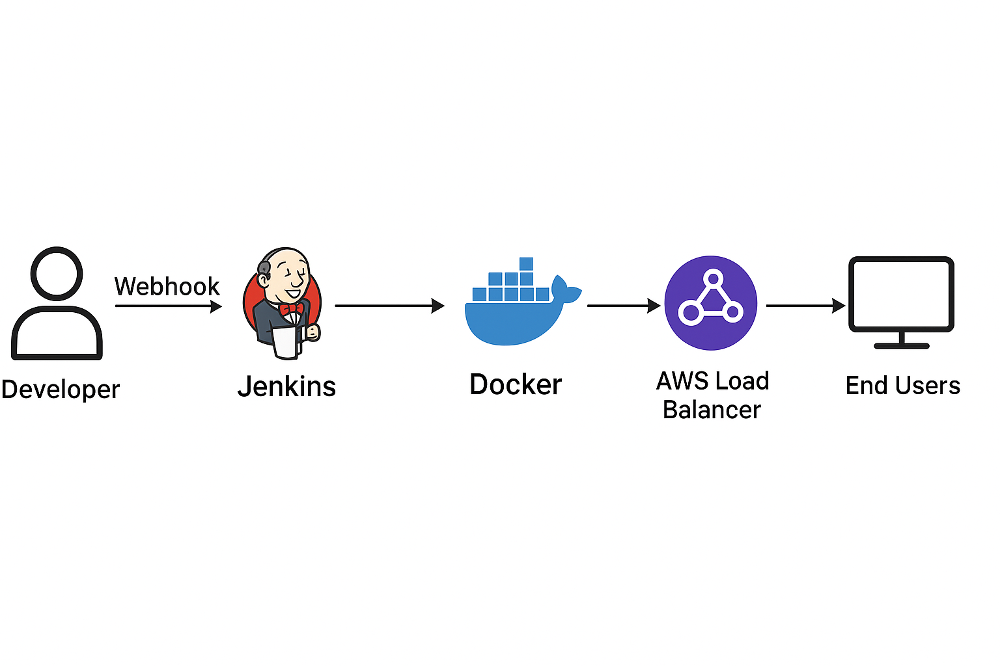

# End-to-End CI/CD Pipeline using Jenkins, Docker & Amazon EKS

## 📌 Project Overview
This project demonstrates a **complete CI/CD workflow** where application code changes pushed to GitHub automatically trigger a Jenkins pipeline that:
- Builds a Docker image
- Pushes the image to Docker Hub
- Performs a rolling update on an Amazon EKS cluster

The infrastructure includes **Amazon EKS**, **EC2 (Jenkins server)**, **Docker**, **Kubernetes**, **GitHub Webhooks**, and **AWS IAM**.

---

## 🧱 Architecture

### 📐 CI/CD Architecture Diagram



**Flow Explanation:**
- Developer pushes code to GitHub
- GitHub Webhook triggers Jenkins pipeline
- Jenkins (running on EC2 with minimum 4 GiB RAM) builds Docker image
- Image is pushed to Docker Hub
- Jenkins updates Kubernetes deployment in Amazon EKS using kubectl
- Kubernetes Service exposes application via AWS Load Balancer
- End users access the application through the Load Balancer DNS

```text
Developer
   |
   v
GitHub Repository
   |
   v
GitHub Webhook
   |
   v
Jenkins (EC2, 4 GiB RAM)
   |\
   | \--> Docker Build & Push
   |       |
   |       v
   |   Docker Hub
   |       |
   |       v
   |   Amazon EKS Cluster
   |        |   |   |
   |    Frontend Backend Database
   |                |
   v                v
kubectl        Kubernetes Service
                    |
                    v
             AWS Load Balancer
                    |
                    v
                 End Users
```

**Explanation:**
- Developers push code to GitHub
- Webhook triggers Jenkins automatically
- Jenkins builds Docker image and pushes to Docker Hub
- Jenkins updates EKS deployment using kubectl
- EKS exposes application using AWS Load Balancer

---

## 🛠️ Technologies Used
- AWS EKS
- AWS EC2 (Amazon Linux 2023)
- IAM Roles & Policies
- Jenkins
- Docker
- Kubernetes (kubectl)
- Git & GitHub Webhooks

---

## 1️⃣ EKS Cluster Setup

### IAM Roles
#### EKS Cluster Role
- **Role Name:** eks-cluster
- **Policy Attached:**
  - AmazonEKSClusterPolicy

#### EKS Node Role
- **Role Name:** EKS-Node-Role
- **Policies Attached:**
  - AmazonEC2ContainerRegistryReadOnly
  - AmazonEKS_CNI_Policy
  - AmazonEKSWorkerNodePolicy

### Cluster Configuration
- VPC: Default
- Subnets: Default
- Add-ons:
  - kube-proxy
  - CoreDNS
  - Amazon VPC CNI
  - Node Monitoring Agent
  - Amazon EKS Pod Identity Agent

### Node Group
- Desired size: 1
- Min size: 1
- Max size: 1
- IAM Role: EKS-Node-Role

---

## 2️⃣ Jenkins Server (EC2)

### Instance Details
- AMI: Amazon Linux 2023 (Kernel 6.1)
- Instance Type: **t2.medium (Minimum 4 GiB RAM required for Jenkins)**
- vCPU: 2
- Memory: 4 GiB
- Storage: 25 GiB gp3
- Security Group:
  - Port 8080 (Jenkins)
  - Port 443 (EKS API)

---

## 3️⃣ Jenkins Installation

```bash
sudo dnf install java-17-amazon-corretto -y
sudo wget -O /etc/yum.repos.d/jenkins.repo https://pkg.jenkins.io/redhat-stable/jenkins.repo
sudo rpm --import https://pkg.jenkins.io/redhat-stable/jenkins.io-2023.key
sudo yum install jenkins -y
sudo systemctl start jenkins
sudo systemctl enable jenkins
```

Access Jenkins:
```
http://<EC2-PUBLIC-IP>:8080
```

Retrieve Admin Password:
```bash
sudo cat /var/lib/jenkins/secrets/initialAdminPassword
```

---

## 4️⃣ Install Required Tools

### Git
```bash
sudo yum install git -y
```

### Docker
```bash
sudo yum install docker -y
sudo systemctl start docker
sudo systemctl enable docker
```

### kubectl
```bash
curl -LO "https://dl.k8s.io/release/$(curl -L -s https://dl.k8s.io/release/stable.txt)/bin/linux/amd64/kubectl"
chmod +x ./kubectl
sudo mv ./kubectl /usr/local/bin/kubectl
kubectl version --client
```

---

## 5️⃣ AWS CLI Configuration
```bash
aws configure
```

---

## 6️⃣ Connect Jenkins to EKS
```bash
aws eks --region ap-south-1 update-kubeconfig --name cluster1
kubectl get nodes
```

---

## 7️⃣ Kubernetes Deployment

```bash
kubectl apply -f fe.yaml
kubectl apply -f be.yaml
kubectl apply -f db.yaml
```

---

## 8️⃣ Jenkins Pipeline
(Refer Jenkinsfile in jenkins/ folder)

---

## 9️⃣ GitHub Webhook Configuration

Payload URL:
```
http://<JENKINS-IP>:8080/github-webhook/
```

---

## 📁 Recommended Repository Structure
```
EKS-Jenkins-CICD/
├── docs/
│   ├── architecture.png
│   ├── eks-cluster.png
│   ├── jenkins-dashboard.png
│   └── pipeline-success.png
├── k8s/
│   ├── fe.yaml
│   ├── be.yaml
│   └── db.yaml
├── jenkins/
│   └── Jenkinsfile
└── README.md
```

---

**Author:** Rahul Hari Kumar  
**GitHub:** https://github.com/DevRahul16
